# ai-vibes

> A tiny CLI that scaffolds AI steering rules for your codebase.

**The problem:** Your AI assistant writes amazing code... that looks nothing like the rest of your codebase. 🤦

**The solution:** Give your AI the vibe check it deserves. Define your team's standards once, and let every AI assistant follow them.

Think of it as `.editorconfig` but for AI behavior. Or a style guide that AIs actually read.

## Install

```bash
# No installation needed - use npx
npx ai-vibes init

# Or install globally
npm install -g ai-vibes
```

**Requirements:** Node.js 18+

## Usage

```bash
# Interactive mode - prompts you for directory and manifest names
npx ai-vibes init

# Or skip the prompts with flags
npx ai-vibes init --dir vibes --manifest vibes.json

# Minimal mode - 3 essential files (recommended)
npx ai-vibes init --minimal

# YAML format (if preferred)
npx ai-vibes init --manifest vibes.yaml

# Overwrite existing files
npx ai-vibes init --force
```

This creates:

- `vibes.json` - Manifest file (JSON format for better IDE support)
- `vibes/` - Directory with rule documents

**Note:** Use `--manifest vibes.yaml` if you prefer YAML format.

## What You Get

### Minimal Mode (3 files)

- `security.md` - Never commit secrets, validate inputs
- `unit-tests.md` - Test behavior, cover edge cases
- `naming.md` - Consistent naming conventions

### Full Mode (11 files)

Everything in minimal, plus:

- `architecture.md` - Follow existing patterns
- `performance.md` - Optimization guidelines
- `code-review.md` - Review standards
- `error-handling.md` - Error patterns
- `documentation.md` - Doc standards
- `accessibility.md` - a11y guidelines
- `api-design.md` - RESTful conventions
- `git-workflow.md` - Commit standards

## Daily Usage

### Working with AI Assistants

Once set up, reference your guidelines when using AI tools:

**GitHub Copilot:**

```
@workspace Follow the guidelines in vibes.json
```

**Cursor:**

```
Create an API endpoint following the guidelines in vibes.json
```

**Claude/ChatGPT:**

```bash
cat vibes.json vibes/*.md
# Paste into your conversation
```

**Note:** File paths in JSON are clickable in most editors for better navigation.

### Updating Guidelines

```bash
# Edit the manifest (JSON format with clickable paths!)
vim vibes.json

# Edit a rule
vim vibes/security.md

# Commit changes
git add vibes.json vibes/
git commit -m "docs: update security guidelines for API keys"
```

## CLI Options

```
npx ai-vibes init [options]

Options:
  --minimal              3 essential files instead of 11
  --force                Overwrite existing files
  --dir <name>           Directory name (interactive prompt if not provided)
  --manifest <filename>  Manifest filename - .json, .yaml, or .yml (default: vibes.json)
  -h, --help             Display help
```

**Interactive Mode:** If you don't provide `--dir` or `--manifest`, you'll be prompted:

```
Directory name for rule documents (default: vibes):
Manifest filename (default: vibes.json):
```

## What It Does

✅ Creates `vibes.json` manifest (JSON format for better IDE support)  
✅ Creates rule documents in Markdown  
✅ Provides starter templates  
✅ Clickable file paths in JSON for easy navigation  
✅ Gives you a place to say "No, AI, we don't do that here"

**Supports both JSON and YAML** - use `--manifest vibes.yaml` if you prefer YAML

## What It Doesn't Do

❌ Does not validate rules (it's not a linter, calm down)  
❌ Does not enforce rules (you still need code review)  
❌ Does not integrate with AI tools directly (BYOAI - Bring Your Own AI)  
❌ Does not make coffee ☕

ai-vibes is intentionally minimal - it scaffolds the structure, you customize the content. Think of it as the starter pack for your AI's training montage.

## Contributing

💡 **Know a better format for steering files?** Have ideas to improve the templates? Found a bug?

Contributions are welcome! Whether it's:

- 🐛 Bug fixes
- ✨ New template ideas
- 📝 Better examples
- 🎨 Format improvements
- ☕ Or just buying me a coffee

Check out [CONTRIBUTING.md](CONTRIBUTING.md) or open an issue.

**Liked the project?** [Buy me a coffee ☕](https://www.buymeacoffee.com/helpbits)

## How It Works

```mermaid
graph TD
    A[🚀 Run: npx ai-vibes init] --> B[📄 Creates vibes.yaml manifest]
    B --> C[📁 Creates vibes/ directory with rule files]
    C --> D[✏️ You customize the markdown files]
    D --> E[🤖 Share with AI assistants]
    E --> F[✨ AI follows your team's standards]

    style A fill:#4CAF50,stroke:#2E7D32,color:#fff
    style B fill:#2196F3,stroke:#1565C0,color:#fff
    style C fill:#2196F3,stroke:#1565C0,color:#fff
    style D fill:#FF9800,stroke:#E65100,color:#fff
    style E fill:#9C27B0,stroke:#6A1B9A,color:#fff
    style F fill:#4CAF50,stroke:#2E7D32,color:#fff
```



**The magic:** The manifest (`vibes.yaml`) acts as a single source of truth that AI tools can read to discover all your coding standards in one place.

## Setup Guide

### Step-by-Step Setup

**1. Navigate to your project**

```bash
cd /path/to/your-project
```

**2. Run ai-vibes**

```bash
npx ai-vibes init
```

**3. Answer the prompts** (or press Enter for defaults)

```
Directory name for rule documents (default: vibes):
Manifest filename (default: vibes.yaml):
```

**4. Choose your mode**

- Want all 11 templates? Just press Enter
- Want minimal (3 files)? Run with `--minimal` flag

**5. Verify the files were created**

```bash
ls vibes/           # Shows your rule files
cat vibes.yaml      # Shows your manifest
```

**6. Customize for your team**

Edit the generated files to match your standards:

```bash
# Add your security requirements
vim vibes/security.md

# Define your naming conventions
vim vibes/naming.md

# Set testing expectations
vim vibes/unit-tests.md
```

**7. Commit to version control**

```bash
git add vibes.yaml vibes/
git commit -m "docs: add AI coding guidelines"
git push
```

**8. Share with your AI assistant**

Now whenever you use an AI tool, reference your guidelines:

```
@workspace Follow the guidelines in vibes.yaml
```

**9. Keep it updated**

As your team's practices evolve, update the markdown files:

```bash
vim vibes/security.md    # Add new security pattern
git commit -am "docs: add OAuth2 security requirements"
```

### What Gets Created

**Minimal Mode** (`--minimal`):

```
your-project/
├── vibes.yaml          # Manifest with 3 rules
└── vibes/
    ├── security.md     # Security guidelines
    ├── unit-tests.md   # Testing standards
    └── naming.md       # Naming conventions
```

**Full Mode** (default):

```
your-project/
├── vibes.yaml              # Manifest with 11 rules
└── vibes/
    ├── security.md         # Security guidelines
    ├── unit-tests.md       # Testing standards
    ├── naming.md           # Naming conventions
    ├── architecture.md     # Architecture patterns
    ├── performance.md      # Performance guidelines
    ├── code-review.md      # Review standards
    ├── error-handling.md   # Error patterns
    ├── documentation.md    # Documentation standards
    ├── accessibility.md    # Accessibility guidelines
    ├── api-design.md       # API conventions
    └── git-workflow.md     # Git standards
```

### Automation

Skip the prompts for CI/CD or scripts:

```bash
npx ai-vibes init --dir .github/ai-rules --manifest ai-rules.yaml --minimal --force
```

## Manifest Format

`vibes.yaml` maps rule IDs to file paths:

```yaml
version: 1

rules:
  security: "vibes/security.md"
  unit-tests: "vibes/unit-tests.md"
  naming: "vibes/naming.md"

order:
  - security
  - unit-tests
  - naming

modes:
  codegen:
    include: [security, unit-tests, naming]
  review:
    include: [security, naming]
```

## Examples

### Basic Setup

```bash
npx ai-vibes init --minimal
```

### Monorepo

```bash
cd packages/api
npx ai-vibes init --dir ../../.ai-rules --manifest ../../ai-rules.yaml
```

### Custom Location

```bash
npx ai-vibes init --dir .github/ai-guidelines
```

## FAQ

**Do I need to install this?**  
No, use `npx ai-vibes init`. One command, zero commitment. Like a coding one-night stand, but productive.

**Can I customize the templates?**  
Yes! That's literally the entire point. These are starting points, not commandments carved in stone.

**Can I add more rules?**  
Absolutely. Got opinions about how semicolons should be used? Write a rule. Passionate about proper emoji usage in commit messages? Add it to the manifest.

**Should I commit these files?**  
Yes! Version control means time travel, and future-you will thank past-you for documenting these decisions.

**Does this work with [my AI tool]?**  
If your AI can read Markdown (spoiler: they all can), then yes. We're tool-agnostic. Bring your favorite AI, we'll provide the guidelines.

## Contributing

Contributions welcome! See [CONTRIBUTING.md](CONTRIBUTING.md).

## License

MIT

---

**Repository:** https://github.com/HelpBits/ai-vibes  
**Version:** 1.0.0
